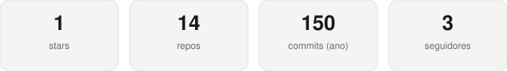

<h1 align="center">Olá! Eu sou o Bruno Sena 👋</h1>

  🔭 Trabalho com <b>front-end</b> e <b>back-end</b> &nbsp;|&nbsp;
  🌱 Estudando <b>Java</b> &nbsp;|&nbsp;
  😄 Pronouns: ele/dele

  
  
  
  
  

 

## 📊 GitHub Metrics

  

  Gerado automaticamente a cada 12h via GitHub Actions — sem depender de servidores externos.

 

## 📫 Contato

  
  

